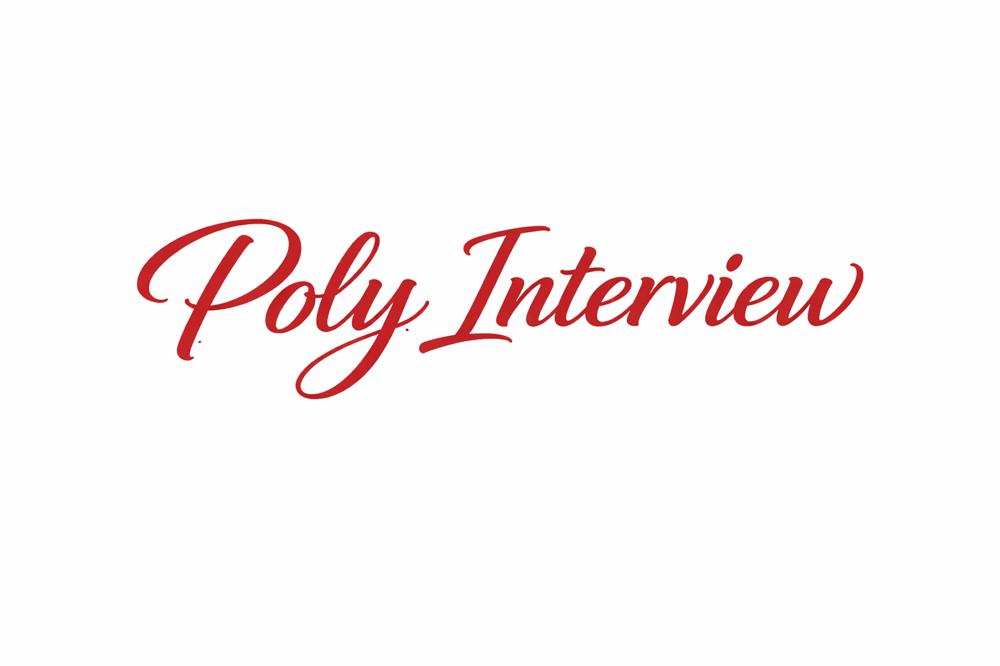
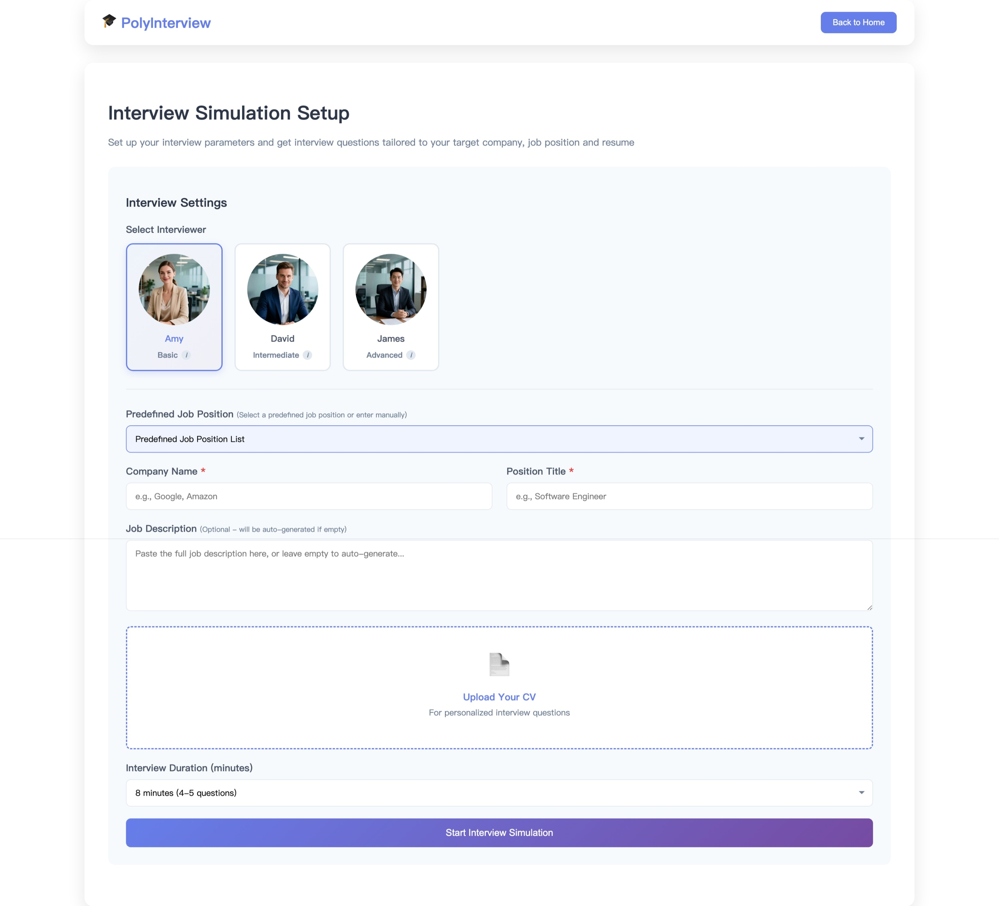

  <h1>PolyInterview</h1>
  
  
<strong>AI-powered mock interviews with real-time feedback to help you land your dream job.</strong>

  

    
    
    
  

> **⚠️ ATTENTION (PolyU Only)**  
> This platform is open to **PolyU students and staff**.  
> Please connect to **PolyUWLAN** first, then access:  
> **https://158.132.255.205:8080/login#/**

---
## Introduction 🌍
Job interview preparation is often high‑stress, fragmented, and ineffective. **93% of candidates experience anxiety before interviews.** Compounded by a lack of constructive feedback, many job seekers are left without a clear path to improvement.

PolyInterview is an end‑to‑end AI interview platform that bridges this gap. It delivers instant, structured, and multimodal feedback through an immersive real‑time **Digital Human Interviewer**.

We address the limitations of existing solutions:
- **Human Coaching:** costly ($100+/hr) and requires scheduling.
- **Peer Mock Platforms:** inconsistent quality and unreliable partners.
- **Text/Voice AI:** lacks visual immersion and “face‑to‑face” pressure.

Why now? The demand for scalable, realistic remote interview practice is surging. Only a real‑time digital human can provide the necessary immersive presence to truly prepare candidates for high‑stakes interactions, all while being affordable and available 24/7.

  

---
## Features ✨
- 🤖 **Interview Simulation:** generate personalized question sets tailored to the company and role.
- 🗣️ **Immersive Digital Human:** experience real‑time lip‑sync interaction with a lifelike digital interviewer (powered by LiveTalking + Wav2Lip).
- 📝 **Actionable Reports:** get detailed, per‑question scoring and specific improvement guidance.
- 🔄 **Closed‑Loop Flow:** seamlessly move from question generation → interview practice → evaluation → iteration.

---
## Project Introduction & Theoretical Foundation 📚
PolyInterview is a comprehensive, AI‑powered job interview simulation platform. It goes beyond simple Q&A by leveraging a sophisticated **multi‑agent LLM architecture** to guide candidates through the entire preparation journey—from interview setup to final performance evaluation.

Our goal is to help candidates master both general interview techniques and position‑specific skills through personalized, multimodal feedback in a highly realistic simulated environment.

### Core System Workflow & Architecture 🧭
The platform operates on an intelligent multi‑agent architecture that orchestrates the entire preparation journey:

1. **Question Generation Agents**
   - **Interview Planner Agent:** builds the interview plan and question list.
   - **Interviewer Agent:** delivers questions and triggers follow‑ups.
2. **Performance Evaluation Agent:** performs **Feature Assessment** (Professional Performance, Way of Expression, Non‑verbal Behavior, Oral Expression), then aggregates results into **Aspect Assessment** and **Proficiency Assessment**, producing evaluation results and improvement suggestions.

### Intelligent Question Generation Logic 🧩
The platform ensures practice relevance by dynamically generating interview questions that align inquiry types with KSA/STAR/Big‑Five dimensions, tailored to the specific job description (JD).

The system strategically deploys different question types:
- **Self‑introduction:** to establish a baseline for communication traits.
- **Behavioral Questions:** to probe past actions, assessing traits and cultural fit.
- **Skill QA:** to directly assess technical capabilities and domain knowledge.
- **Scenario Simulation:** to evaluate problem‑solving abilities in hypothetical job situations.

Example: for a technical role requiring programming expertise and collaboration, the system generates Skill QA questions targeting technical requirements and Behavioral questions targeting team‑oriented traits. Mapping follows the diagram: **KSA** emphasizes Skill QA, **STAR** structures scenario/behavioral responses, and **Big‑Five** supports trait‑focused behavioral analysis.

**Adaptive follow‑ups:** To maintain a smooth and natural interview process, the system will check **Consistency**, **Clarity**, and **Relevance** of the answers, and adaptively generate follow‑up questions to challenge contradictory answers, probe unclear points, and handle irrelevant responses.

### Theoretical Assessment Frameworks 🧠
To provide objective and structured feedback, the assessment engine is grounded in robust theoretical frameworks that define candidate competency and communication effectiveness.
KSA defines what is evaluated, STAR defines how responses are structured, and Big-Five provides a behavioral interpretation layer.

**KSA Competency Framework (Knowledge, Skills, Abilities)** [4]
- **Knowledge (K):** domain‑specific information applied to job tasks.
- **Skills (S):** learned proficiencies demonstrated through performance.
- **Abilities (A):** underlying capacity to perform observable behaviors.

**STAR Method (Expression Technique)** [5]
- **Situation (S):** the context or background of the scenario.
- **Task (T):** your responsibility or goal.
- **Action (A):** the specific steps you took.
- **Result (R):** the outcome and impact.

**Big‑Five Personality Model (Behavioral Traits)** [6]
- **Openness, Conscientiousness, Extraversion, Agreeableness, Neuroticism** as a trait lens for behavioral and communication assessment.

**🟦 Multimodal Interview Assessment Framework**  
This section explains the internal evaluation architecture and theoretical grounding of PolyInterview. [1–3]

- **Inputs:** **Text**, **Audio**, **Video** from the interview session.
- **Models:**  
  - **LLM** for text understanding  
  - **VLM** for visual/non‑verbal cues  
  - **Audio‑LLM** for speech and vocal delivery
- **Aggregation:** scores flow from **Feature → Aspect → Proficiency**, where features are per‑response signals, aspects summarize cross‑response dimensions, and proficiency provides the overall evaluation.

### References 📖
1. Hollandsworth Jr, J. G., Kazelskis, R., Stevens, J., & Dressel, M. E. (1979). Relative contributions of verbal, articulative, and nonverbal communication to employment decisions in the job interview setting. *Personnel Psychology*, 32(2), 359–367.
2. Martín‑Raugh, M. P., Leong, C. W., Roohr, K. C., & Chen, X. (2023). Perceived conscientiousness and openness to experience mediate the relationship between vocal and visual features and hiring decision in the interview. *Computers in Human Behavior Reports*, 10, 100272.
3. Martín‑Raugh, M. P., Kell, H. J., Randall, J. G., Anguiano‑Carrasco, C., & Banfi, J. T. (2023). Speaking without words: A meta‑analysis of over 70 years of research on the power of nonverbal cues in job interviews. *Journal of Organizational Behavior*, 44(1), 132–156.
4. U.S. Office of Personnel Management. *General Schedule Qualification Policies* (KSA definitions).  
5. Indiana University School of Public Health Career Services. (2018). *What is the STAR Interview Method?*
6. McCrae, R. R., & John, O. P. (1992). An introduction to the five‑factor model and its applications. *Journal of Personality*, 60(2), 175–215.
---
## Interface Preview 🖥️
### Interview Setting

  

### Interview

  

### Assessment Report (Sample)

  

---
## Version Updates 🆕

Version 0.1.0

## Update Date 2026-02-11

### Added

**Core Platform**
- Build AI-powered interview preparation platform with resume optimization and mock interviews
- Implement user authentication system with JWT, profiles, and admin dashboard
- Enable HTTPS across all services with SSL certificate generation
- Add maintenance page for graceful server updates

**Digital Human**
- Integrate digital human interviewer powered by LiveTalking, Wav2Lip, and WebRTC streaming
- Implement session pool for multi-user concurrent access
- Support multiple interviewer avatars with distinct voices and difficulty levels (Basic/Intermediate/Advanced)
- Add interviewer style selection with customizable prompts

**Interview System**
- Implement 5-stage interview flow: Setup, Queue, Loading, Live, and Feedback
- Generate personalized interview questions via LLM based on resume, position, and JD
- Add real-time speech-to-text using Qwen3-ASR
- Support adaptive follow-up question generation
- Add pronunciation assessment with WAV recording
- Display real-time audio waveform visualization during interview
- Play closing response from digital human after interview ends

**Evaluation System**
- Implement competency-based evaluation framework (V2) with 13 features, 10 aspects, and final scores
- Add VLM-based non-verbal behavior analysis (eye contact, facial expression, body posture, gesture)
- Enable real-time per-question evaluation during interview
- Unify scoring to 0-10 scale across all dimensions
- Generate aspect and feature summaries with improvement suggestions
- Add PDF evaluation report download
- Add JSON sanitizer for robust LLM response parsing

**Frontend**
- Add landing page with embedded login and welcome back card
- Display user avatar and profile navigation in header
- Support job position selection with company and JD input
- Add user survey in evaluation feedback page
- Add interviewer selector with info tooltips

**Backend**
- Add unified colored logging system with structured logging
- Centralize model configuration for one-click provider switching
- Support DashScope international endpoint (Singapore)
- Add unified service startup for digital human and STT
- Extract prompts to external template files for maintainability

### Changed
- Migrate STT from AssemblyAI to Qwen3-ASR with upgraded models
- Simplify interviewers from 5 to 3 with difficulty progression
- Unify question_index to 1-based throughout the system
- Replace transcript textarea with audio waveform visualization
- Make JD optional in interview setup

### Fixed
- Remove double division by 10 in oral expression score calculation
- Resolve VLM race conditions causing API 400 errors
- Correct score scaling for Logic and VLM dimensions
- Fix question scores showing 0 in feedback stage
- Prevent closing message audio cutoff on interview end
- Handle None scores in pronunciation assessment
- Prevent atexit from killing services on reloader restart
- Separate interview and media timestamps for unique filenames
- Wait for async question evaluations before finalizing results
- Fix digital human connection and video format conversion issues

<!-- - **2026-01-31** — Added high‑demand queue stage for interview sessions and improved session orchestration.
- **2026-01-30** — Added user‑facing workflow manual, updated architecture visuals, and refreshed hero assets.
- **2025-12-15** — Introduced real‑time digital human interviewer powered by LiveTalking + Wav2Lip.
- **2025-11-01** — Launched structured assessment reports. -->

